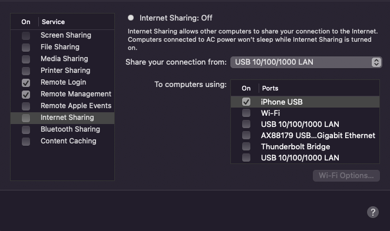
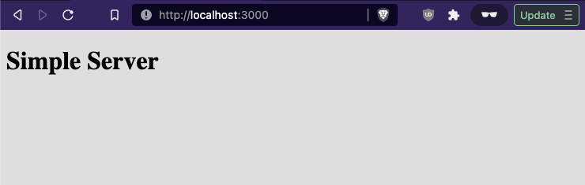
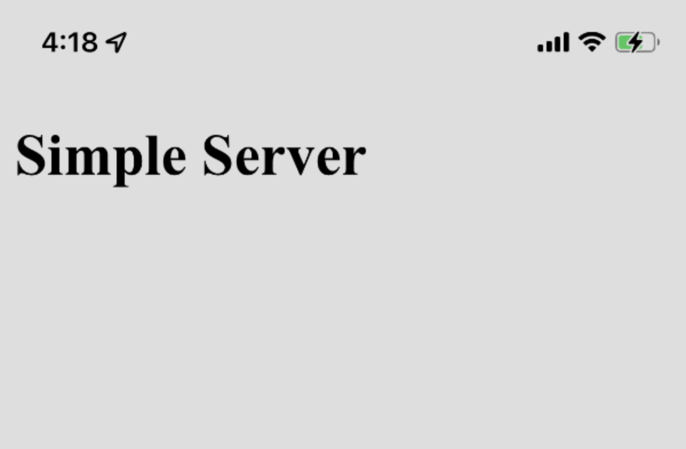

# Simple Server

## Start Server

- Run `npm ci` to install deps
- Run `npm start` to start the server

## View on iPhone

Once the server is running, you can view it on your iPhone relatively easily.

- Plug your iPhone in to your computer via USB
- Ensure the server is running on `http://localhost:3000`
- Open System Preferences > Sharing
- Copy your computer's network name (e.g. `gizmocluster.local`)
- Enable Internet Sharing via the iPhone USB interface
- Open your computer's name and port on your iPhone browser (e.g. `gizmocluster.local:3000`)

| Internet Sharing | Mac | iPhone |
| ---------------- | --- | ------ |
|  |  |  |

## Packages

- [Lite Server](https://www.npmjs.com/package/lite-server)

# Alternate Server via Python

- Check the output of `python --version` and `python3 --version`
- Whichever shows `=> 3` use that one below
- Run `python -m http.server` in the directory to share
- Ensure the server is running on `http://localhost:8000`
- Open System Preferences > Sharing
- Copy your computer's network name (e.g. `gizmocluster.local`)
- Enable Internet Sharing via the iPhone USB interface
- Open your computer's name and port on your iPhone browser (e.g. `gizmocluster.local:8000`)
